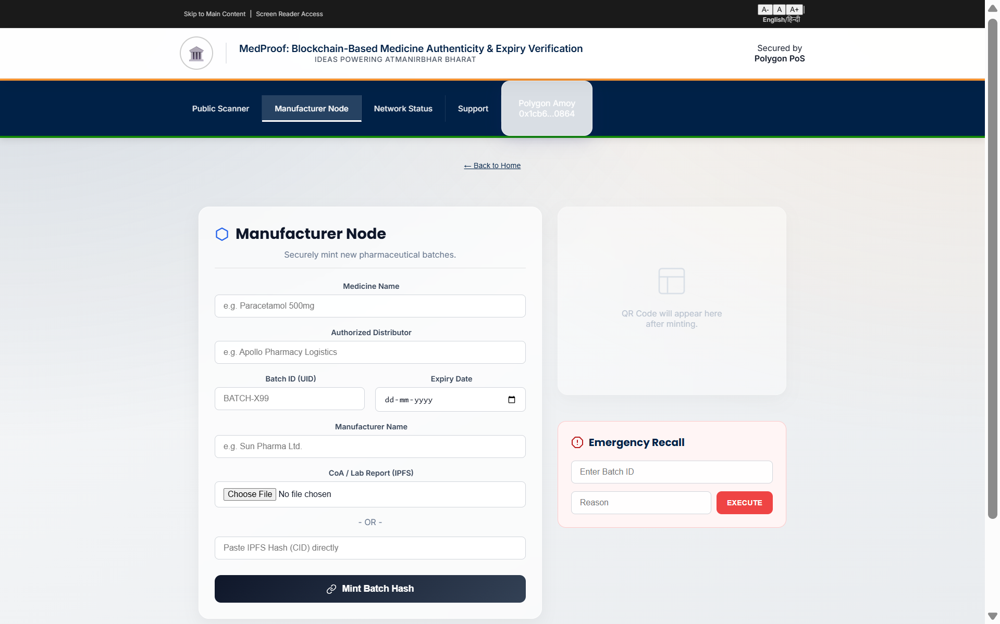
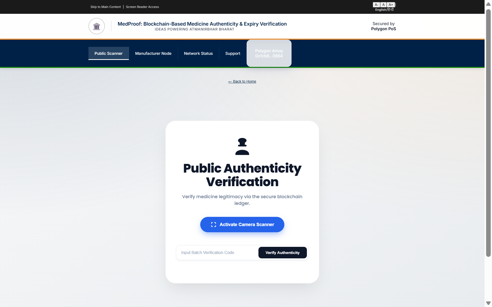

# MedProof🛡️

### Decentralized Pharmaceutical Authenticity & Expiry Verification System

> **Theme:** INNOVIT 2026 (TH03 - MedTech)  
> **Team:** Rooted  
> **Tagline:** *Ideas Powering Atmanirbhar Bharat*

[](https://medproof-v1.web.app/)
[](https://amoy.polygonscan.com/)
[](LICENSE)
[]()

---

## Overview

**MedProof** is a blockchain-powered **Truth Infrastructure** designed to protect the pharmaceutical supply chain from counterfeit and expired medicines.

Centralized verification systems are opaque and vulnerable to manipulation. MedProof permanently anchors medicine batch data onto the **Polygon blockchain**, creating an immutable public ledger.

Through a **simple QR scan — no wallet required —** even rural patients can instantly verify whether their medicine is safe to consume.

---

## Why MedProof?

### 👨‍⚕️ For Patients
- One-tap Green / Red authenticity result
- Works without crypto knowledge
- Multilingual support

### 🏭 For Manufacturers
- Prevent counterfeits
- On-chain recalls in emergencies
- Preserve brand trust

### 🇮🇳 For India
- Indigenous (*Atmanirbhar*) verification layer
- Reduces reliance on foreign systems
- Supports national health security

---

## Current Progress Description (Phase 2)

We have successfully transformed our Phase 1 concept into a **fully functional Phase 2 Prototype**.  
The core **Verification Loop** (Manufacturer → Blockchain → Patient) is live and operational.

---

### ✅ Completed & Deployed Modules

- **Smart Contract Infrastructure:**
  - `MedRegistry.sol` deployed on **Polygon Amoy Testnet**
  - Immutable logic for **Expiry Validation**, **Batch Existence**, and **Emergency Recalls**

- **Manufacturer Node (Web Portal):**
  - **RBAC Login:** Authorized wallets only
  - **IPFS Integration:** Automated CoA uploads via Pinata
  - **QR Engine:** Auto-generated QR codes for Batch IDs

- **Patient Verification Layer:**
  - **Public RPC:** Wallet-free blockchain reads
  - **Scanner:** HTML5 camera-based mobile scanning
  - **Bilingual UI:** Hindi / English toggle

- **Hosting:**
  - Frontend deployed globally using **Google Firebase**

---

### 🔜 In Development (Phase 3 Roadmap)

- **Pro Mode:** Advanced dashboards for hospitals & pharmacists
- **Analytics Engine:** Heatmaps identifying counterfeit hotspots
- **Supply Chain Handover:** Distributor-level verification checkpoints

---

## Key Features

### 1️⃣ 🛡️ Immutable Expiry Guard

Smart contracts enforce expiry logic on-chain:

```solidity
if (block.timestamp > batch.expiryDate) {
    revert("Batch Expired");
}
```
Even if printed packaging is altered — the blockchain tells the truth.

### 2️⃣ Emergency Batch Recall ("Kill Switch")
Manufacturers can trigger a global recall for contaminated or faulty batches.

All scanners instantly show:

> **⚠️ CRITICAL — DO NOT CONSUME**

### 3️⃣ 🗣️ Bilingual Inclusion (Hindi / English)
Designed for rural accessibility using:
- React Context API
- Dynamic UI language switching

### 4️⃣ 📄 Tamper-Proof Lab Reports
Certificates of Analysis (CoA PDFs):
- Uploaded to IPFS
- Hash stored on-chain
- Cannot be replaced or deleted

---

## System Architecture

| Layer | Technology | Purpose |
| :--- | :--- | :--- |
| **Blockchain** | Polygon Amoy | Immutable Batch Registry |
| **Smart Contract** | Solidity (v0.8.20) | RBAC, Expiry Logic, Recall |
| **Frontend** | React.js | QR Scan, Walletless Reads |
| **Storage** | IPFS (Pinata) | Certificates |
| **Backend** | Node.js / Express | Secure Upload API |
| **Deployment** | Firebase Hosting | CDN Web App |

---

## Screenshots

| Manufacturer Dashboard | Patient Scanner |
| :---: | :---: |
| Register batches & recalls | Green / Red verification |
|  |  |
---

## Installation & Local Setup
Run the entire MedProof stack locally.

### Prerequisites
- Node.js v16+
- MetaMask Wallet (Polygon Amoy)
- Pinata API Keys
- Hardhat

### 1. Clone Repository
```bash
git clone https://github.com/mayankjhn/medproof.git
cd medproof
```

### 2. Backend Setup (IPFS Relay)
```bash
cd backend
npm install
```
Create `.env`:
```bash
PINATA_API_KEY=your_key
PINATA_SECRET_KEY=your_secret
```
Start server:
```bash
npm start
```
Runs on: `http://localhost:3001`

### 3. Smart Contract Deployment
```bash
npm install
npx hardhat compile
npx hardhat run scripts/deploy.js --network amoy
```
Copy the deployed contract address.

### 4. Frontend Setup
```bash
cd frontend
npm install
```
Update `src/utils/contracts.js` with your deployed address.

Run app:
```bash
npm start
```
Runs on: `http://localhost:3000`

---

## Smart Contract Details
- **Network:** Polygon Amoy Testnet
- **Contract Address:** `0xYOUR_CONTRACT_ADDRESS`
- **Explorer:** [https://amoy.polygonscan.com](https://amoy.polygonscan.com)

---

## Team — Rooted
Built with ❤️ for **INNOVIT 2026**.

- **Mayank Agarwal** — Lead Developer (Blockchain & Full-Stack)
- **Shivam Singh** — Lead Developer (Frontend)

---

## 📄 License
This project is licensed under the MIT License.
See the [LICENSE](LICENSE) file for details.